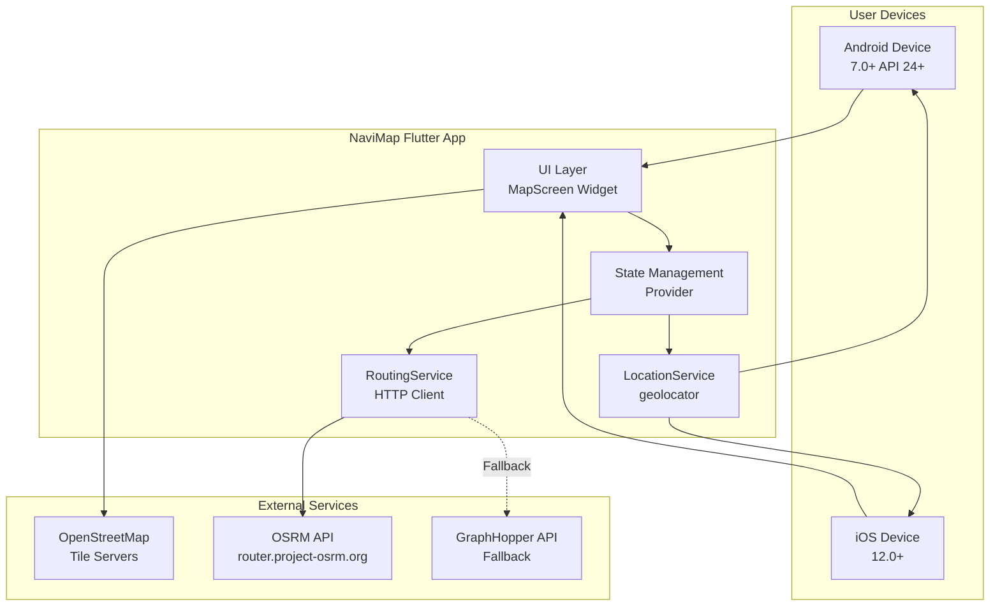
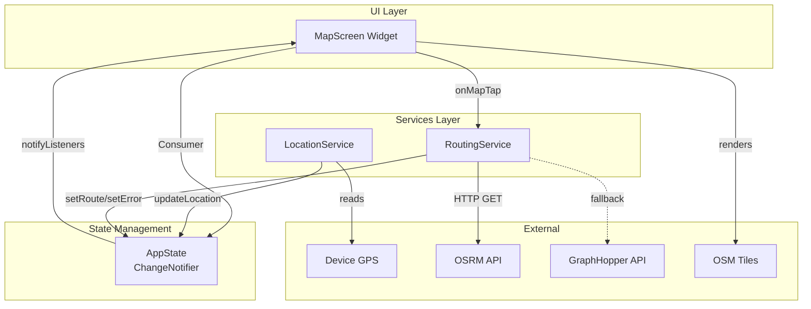
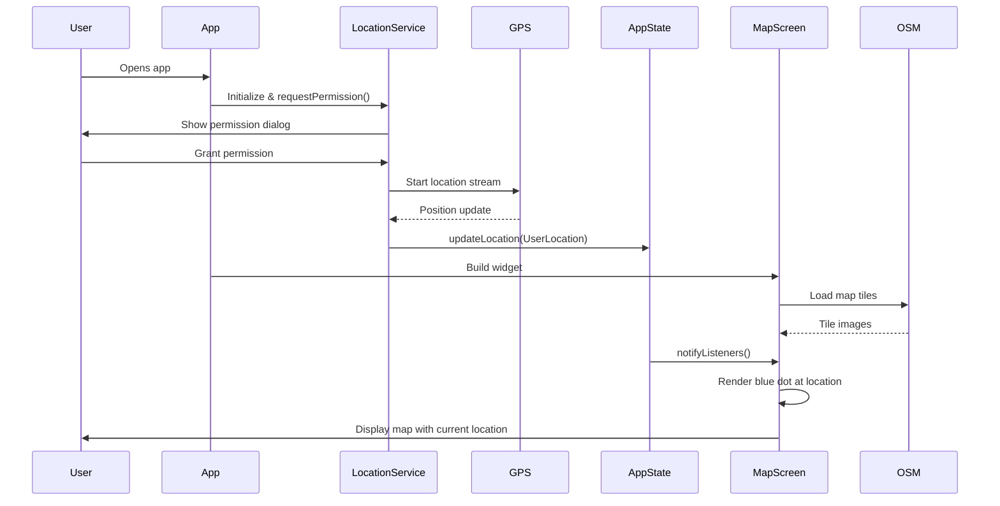
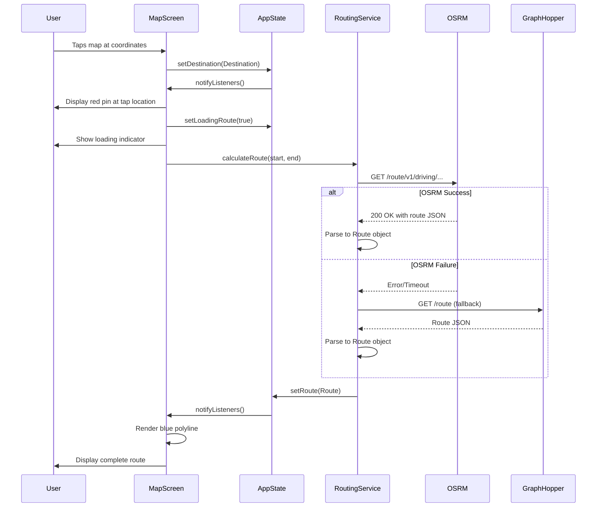
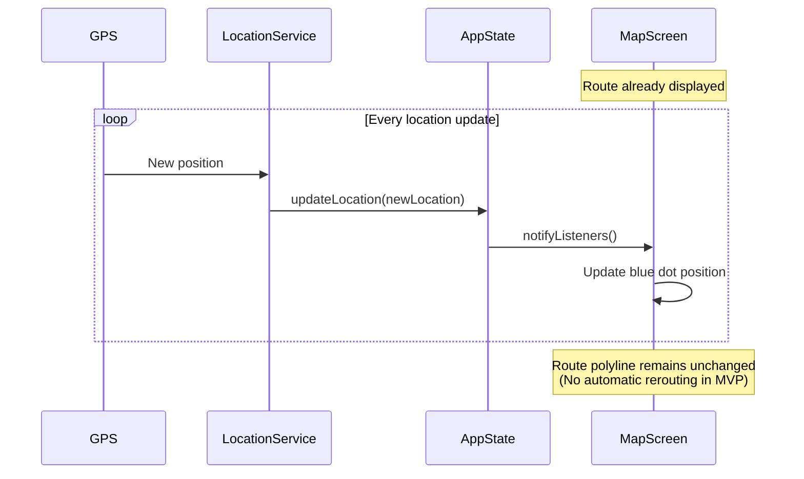

# NaviMap Architecture Document

## Introduction

This document outlines the complete architecture for **NaviMap**, a privacy-first, open-source mobile navigation application built with Flutter. NaviMap is designed for rapid MVP development (7-day timeline) with zero backend infrastructure - the application runs entirely on the client device and integrates with free open-source routing APIs (OSRM and GraphHopper).

Unlike traditional fullstack applications, NaviMap is a **mobile-first client application** that:

- Runs natively on Android (7.0+) and iOS (12.0+) via Flutter
- Uses OpenStreetMap for map rendering
- Calls external routing APIs for route calculations
- Stores zero persistent data (ephemeral state only)
- Requires no authentication, user accounts, or custom backend

This architecture serves as the definitive guide for AI-assisted development, ensuring consistency across all implementation phases while maintaining the radical simplicity demanded by the PRD.

### Starter Template or Existing Project

**N/A - Greenfield Flutter Project**

This is a greenfield project starting from `flutter create`. While Flutter provides starter templates, we're building from scratch to maintain minimal dependencies and full control over architecture decisions. The standard Flutter project structure will be adapted for our specific needs.

### Change Log

| Date       | Version | Description                   | Author              |
| ---------- | ------- | ----------------------------- | ------------------- |
| 2025-11-11 | 1.0     | Initial architecture document | Winston (Architect) |

## High Level Architecture

### Technical Summary

NaviMap employs a **single-tier mobile client architecture** built with Flutter 3.24+ and Dart 3.5+. The application renders an interactive map using the flutter_map package with OpenStreetMap tiles, manages location via the geolocator package, and calculates routes by making HTTPS requests to external OSRM/GraphHopper APIs. State management uses the Provider pattern for reactive UI updates. The architecture eliminates all backend infrastructure - there are no servers, databases, or authentication systems. The app runs entirely on-device with stateless API calls to third-party routing services. This minimalist approach enables rapid MVP delivery, ensures privacy compliance (zero data collection), and achieves the PRD's goal of 100% open-source, zero-cost operation.

### Platform and Infrastructure Choice

**Platform:** None (client-side mobile app)  
**Key External Services:** OpenStreetMap tiles, OSRM routing API, GraphHopper routing API (fallback)  
**Deployment Targets:** Android 7.0+ (API 24+), iOS 12.0+  
**Distribution:** Google Play Store, Apple App Store

### Repository Structure

**Structure:** Single Repository (Monolithic Flutter Project)  
**Monorepo Tool:** N/A - standard Flutter project  
**Package Organization:** Single `lib/` directory with feature-based organization

### High Level Architecture Diagram



### Architectural Patterns

- **Single-Screen Application:** Entire UI is one full-screen map widget with no navigation chrome - _Rationale:_ Aligns with PRD's radical minimalism goal, reduces development complexity, eliminates need for navigation libraries

- **Service-Oriented Architecture (SOA):** Business logic separated into focused services (LocationService, RoutingService) - _Rationale:_ Testability, separation of concerns, enables AI agents to work on isolated components

- **Provider State Management:** Reactive state updates using Flutter's provider package - _Rationale:_ Official recommendation, simple for small apps, perfect for location/route state propagation to UI

- **Repository Pattern (Lightweight):** RoutingService abstracts API implementation details with fallback logic - _Rationale:_ Enables switching between OSRM/GraphHopper transparently, future-proofs for self-hosted APIs

- **Stateless Architecture:** Zero persistent storage, all state ephemeral and cleared on app close - _Rationale:_ Satisfies NFR6/NFR12 privacy requirements, eliminates database complexity

- **Fail-Fast with Graceful Degradation:** Primary API failures trigger immediate fallback to secondary API - _Rationale:_ Ensures routing availability despite free API unreliability, meets NFR11

- **Direct API Integration (No Backend):** Client makes direct HTTPS calls to external routing APIs - _Rationale:_ Eliminates backend development/hosting costs, achieves NFR5 (zero paid services)

## Tech Stack

### Technology Stack Table

| Category                 | Technology     | Version | Purpose                           | Rationale                                                                                         |
| ------------------------ | -------------- | ------- | --------------------------------- | ------------------------------------------------------------------------------------------------- |
| **Mobile Framework**     | Flutter        | 3.24+   | Cross-platform mobile development | Official stable version, mature ecosystem, excellent performance, single codebase for Android/iOS |
| **Language**             | Dart           | 3.5+    | Application language              | Required by Flutter, strong typing, null safety, modern async/await                               |
| **Map Rendering**        | flutter_map    | 7.0.0   | Interactive map display           | Open-source, OSM-compatible, actively maintained, no proprietary SDKs                             |
| **Map Tiles**            | OpenStreetMap  | N/A     | Map tile provider                 | Free, open-source, no API keys, aligns with NFR5                                                  |
| **Coordinate Utilities** | latlong2       | 0.9.0   | Lat/Lng calculations              | Required by flutter_map, geographic calculations                                                  |
| **Location Services**    | geolocator     | 12.0.0  | GPS/positioning                   | Cross-platform, robust permissions handling, actively maintained                                  |
| **HTTP Client**          | http           | 1.2.0   | API requests                      | Official Dart package, simple, sufficient for REST calls                                          |
| **State Management**     | provider       | 6.1.0   | Reactive state updates            | Official recommendation, simple, perfect for small apps                                           |
| **Primary Routing API**  | OSRM           | N/A     | Route calculation                 | Free demo server, no API key, fast, reliable                                                      |
| **Fallback Routing API** | GraphHopper    | N/A     | Route calculation backup          | Free tier (500/day), API key required, good fallback                                              |
| **Unit Testing**         | flutter_test   | SDK     | Unit/widget tests                 | Built-in Flutter testing framework                                                                |
| **Mocking**              | mockito        | 5.4.0   | Test mocking                      | Industry standard for Dart/Flutter                                                                |
| **Build Tool**           | Flutter CLI    | 3.24+   | Build/run/test                    | Official tooling, integrated with SDK                                                             |
| **Linting**              | flutter_lints  | 4.0.0   | Code quality                      | Official lint rules, enforces best practices                                                      |
| **CI/CD**                | GitHub Actions | N/A     | Automated builds/tests            | Free for public repos, good Flutter support                                                       |
| **Version Control**      | Git            | 2.40+   | Source control                    | Industry standard                                                                                 |
| **License**              | MIT or GPL v3  | N/A     | Open-source license               | Per NFR10, community-friendly                                                                     |

**Notes:**

- No connectivity detection package needed - relying on API error handling
- flutter_map handles tile caching internally - no additional package required
- No database, local storage, analytics, or crash reporting per privacy requirements

## Data Models

### Core Data Models

#### UserLocation

**Purpose:** Represents the user's current GPS position with accuracy information.

**Key Attributes:**

- `latitude`: `double` - Geographic latitude in degrees (-90 to 90)
- `longitude`: `double` - Geographic longitude in degrees (-180 to 180)
- `accuracy`: `double?` - Position accuracy in meters (optional)
- `timestamp`: `DateTime` - When the position was captured

**Dart Class:**

```dart
class UserLocation {
  final double latitude;
  final double longitude;
  final double? accuracy;
  final DateTime timestamp;

  UserLocation({
    required this.latitude,
    required this.longitude,
    this.accuracy,
    required this.timestamp,
  });

  LatLng toLatLng() => LatLng(latitude, longitude);
}
```

**Relationships:** Used by LocationService, consumed by MapScreen and RoutingService

---

#### Destination

**Purpose:** Represents the destination point selected by the user via map tap.

**Key Attributes:**

- `latitude`: `double` - Geographic latitude in degrees
- `longitude`: `double` - Geographic longitude in degrees

**Dart Class:**

```dart
class Destination {
  final double latitude;
  final double longitude;

  Destination({
    required this.latitude,
    required this.longitude,
  });

  LatLng toLatLng() => LatLng(latitude, longitude);
}
```

**Relationships:** Created by MapScreen on tap gesture, consumed by RoutingService for route calculation

---

#### Route

**Purpose:** Represents a calculated route from current location to destination, including the polyline path and metadata.

**Key Attributes:**

- `points`: `List<LatLng>` - Ordered list of coordinates forming the route polyline
- `distance`: `double` - Total route distance in meters
- `duration`: `double` - Estimated travel time in seconds
- `geometry`: `String?` - Encoded polyline geometry (optional, from API response)

**Dart Class:**

```dart
class Route {
  final List<LatLng> points;
  final double distance;
  final double duration;
  final String? geometry;

  Route({
    required this.points,
    required this.distance,
    required this.duration,
    this.geometry,
  });

  String get distanceKm => '${(distance / 1000).toStringAsFixed(1)} km';
  String get durationMin => '${(duration / 60).round()} min';
}
```

**Relationships:** Created by RoutingService from API response, consumed by MapScreen for polyline rendering

---

#### AppState

**Purpose:** Central application state managed by Provider, combines all data models.

**Dart Class:**

```dart
class AppState extends ChangeNotifier {
  UserLocation? _currentLocation;
  Destination? _destination;
  Route? _route;
  bool _isLoadingRoute = false;
  String? _errorMessage;

  // Getters
  UserLocation? get currentLocation => _currentLocation;
  Destination? get destination => _destination;
  Route? get route => _route;
  bool get isLoadingRoute => _isLoadingRoute;
  String? get errorMessage => _errorMessage;

  // Setters that notify listeners
  void updateLocation(UserLocation location) {
    _currentLocation = location;
    notifyListeners();
  }

  void setDestination(Destination dest) {
    _destination = dest;
    notifyListeners();
  }

  void setRoute(Route? route) {
    _route = route;
    _isLoadingRoute = false;
    notifyListeners();
  }

  void setLoadingRoute(bool loading) {
    _isLoadingRoute = loading;
    notifyListeners();
  }

  void setError(String? error) {
    _errorMessage = error;
    notifyListeners();
  }

  void clearError() {
    _errorMessage = null;
    notifyListeners();
  }
}
```

## API Specification

Since NaviMap has no custom backend API, this section documents the **external routing APIs** we integrate with: OSRM (primary) and GraphHopper (fallback).

### OSRM API (Primary)

**Base URL:** `https://router.project-osrm.org`  
**Documentation:** http://project-osrm.org/docs/v5.24.0/api/  
**Authentication:** None required (public demo server)  
**Rate Limits:** Fair use policy (no hard limits documented)

**Endpoint:** `GET /route/v1/driving/{coordinates}`

**Request Format:**

```
GET https://router.project-osrm.org/route/v1/driving/{lon1},{lat1};{lon2},{lat2}?overview=full&geometries=geojson
```

**Query Parameters:**

- `overview=full` - Include full route geometry
- `geometries=geojson` - Return coordinates as GeoJSON (array of [lon, lat])

**Example Request:**

```
GET https://router.project-osrm.org/route/v1/driving/-122.4194,37.7749;-122.4089,37.7849?overview=full&geometries=geojson
```

**Response Schema (Success - 200 OK):**

```json
{
  "code": "Ok",
  "routes": [
    {
      "geometry": {
        "coordinates": [
          [-122.4194, 37.7749],
          [-122.418, 37.776],
          [-122.4089, 37.7849]
        ],
        "type": "LineString"
      },
      "distance": 1234.5,
      "duration": 180.2
    }
  ]
}
```

### GraphHopper API (Fallback)

**Base URL:** `https://graphhopper.com/api/1`  
**Documentation:** https://docs.graphhopper.com/  
**Authentication:** API key required (free tier: 500 requests/day)  
**Rate Limits:** 500 requests/day, 10 requests/minute

**Endpoint:** `GET /route`

**Request Format:**

```
GET https://graphhopper.com/api/1/route?point={lat1},{lon1}&point={lat2},{lon2}&vehicle=car&key={API_KEY}&points_encoded=false
```

**Response Schema (Success - 200 OK):**

```json
{
  "paths": [
    {
      "distance": 1234.5,
      "time": 180200,
      "points": {
        "coordinates": [
          [-122.4194, 37.7749],
          [-122.418, 37.776],
          [-122.4089, 37.7849]
        ]
      }
    }
  ]
}
```

### API Integration Strategy

**Fallback Logic:**

```dart
Future<Route> calculateRoute(UserLocation start, Destination end) async {
  try {
    return await _fetchRouteFromOSRM(start, end);
  } catch (e) {
    try {
      return await _fetchRouteFromGraphHopper(start, end);
    } catch (e2) {
      throw RoutingException('Both routing services failed');
    }
  }
}
```

**Configuration:**

- OSRM timeout: 5 seconds
- GraphHopper timeout: 5 seconds
- All requests over HTTPS
- User-Agent: `NaviMap/1.0 (Open Source Navigation MVP)`

## Components

### Component Architecture

#### MapScreen (UI Layer)

**Responsibility:** Full-screen map interface, user interaction handling, visual rendering of location/destination/route

**Key Interfaces:**

- Consumes `AppState` via Provider for reactive UI updates
- Exposes tap gesture handler: `onMapTap(LatLng coordinates)`
- Renders flutter_map widget with OSM tiles
- Displays markers (blue dot for location, red pin for destination)
- Renders route polyline overlay

**Dependencies:** AppState, RoutingService, flutter_map, latlong2

**Technology Stack:** Flutter widgets (StatelessWidget consuming Provider), flutter_map's FlutterMap widget, Material Design components

---

#### LocationService (Business Logic Layer)

**Responsibility:** GPS position tracking, permission handling, location stream management

**Key Interfaces:**

- `Stream<UserLocation> getLocationStream()` - Continuous location updates
- `Future<UserLocation> getCurrentLocation()` - One-time location fetch
- `Future<bool> requestPermission()` - Handle location permissions
- `Future<bool> isLocationServiceEnabled()` - Check GPS enabled

**Dependencies:** geolocator package, AppState

**Technology Stack:** Dart async/await and Streams, geolocator for cross-platform GPS access

---

#### RoutingService (Business Logic Layer)

**Responsibility:** Route calculation via external APIs, fallback logic, response parsing, error handling

**Key Interfaces:**

- `Future<Route> calculateRoute(UserLocation start, Destination end)` - Main calculation method
- `Future<Route> _fetchRouteFromOSRM(...)` - OSRM API call (private)
- `Future<Route> _fetchRouteFromGraphHopper(...)` - GraphHopper API call (private)

**Dependencies:** http package, AppState

**Technology Stack:** Dart async/await, http package for REST calls, JSON parsing with dart:convert

**Implementation Notes:** Implements fallback logic (OSRM primary, GraphHopper fallback), 5-second timeout per API call

---

#### AppState (State Management Layer)

**Responsibility:** Central state container, reactive change notifications, state coordination

**Key Interfaces:**

- `UserLocation? currentLocation` - Current GPS position
- `Destination? destination` - User-selected destination
- `Route? route` - Calculated route
- `bool isLoadingRoute` - Loading state for UI
- `String? errorMessage` - Error state for toast display
- State update methods that call `notifyListeners()`

**Dependencies:** provider package (ChangeNotifier)

**Technology Stack:** Provider pattern (ChangeNotifier + Consumer), Dart null safety

---

### Component Interaction Diagram



## Core Workflows

### Workflow 1: App Launch and Initial Location Display



**Success Criteria:** Map loads within 3 seconds (NFR1), location appears as blue dot

---

### Workflow 2: User Sets Destination and Views Route



**Success Criteria:** Route calculates within 5 seconds (NFR3), polyline renders smoothly

---

### Workflow 3: Location Updates While Route Active



**Success Criteria:** Blue dot updates smoothly, UI responds within 100ms (NFR2)

**MVP Limitation:** No automatic rerouting when user deviates from path (out of scope)

## File and Folder Structure

### Project Directory Layout

```
navimap/
├── android/                      # Android native configuration
│   ├── app/
│   │   ├── src/main/
│   │   │   └── AndroidManifest.xml  # Location permissions
│   │   └── build.gradle          # Min SDK 24 (Android 7.0)
│   └── build.gradle
├── ios/                          # iOS native configuration
│   ├── Runner/
│   │   ├── Info.plist            # Location permissions, iOS 12.0+
│   │   └── AppDelegate.swift
│   └── Podfile
├── lib/                          # Main application code
│   ├── main.dart                 # App entry point, Provider setup
│   ├── models/                   # Data models
│   │   ├── user_location.dart    # UserLocation class
│   │   ├── destination.dart      # Destination class
│   │   └── route.dart            # Route class
│   ├── services/                 # Business logic services
│   │   ├── location_service.dart # GPS/positioning logic
│   │   └── routing_service.dart  # API integration, fallback logic
│   ├── state/                    # State management
│   │   └── app_state.dart        # AppState ChangeNotifier
│   ├── screens/                  # UI screens
│   │   └── map_screen.dart       # Main map interface
│   └── widgets/                  # Reusable UI components (if needed)
├── test/                         # Unit and widget tests
│   ├── models/
│   │   ├── user_location_test.dart
│   │   ├── destination_test.dart
│   │   └── route_test.dart
│   ├── services/
│   │   ├── location_service_test.dart
│   │   └── routing_service_test.dart
│   └── state/
│       └── app_state_test.dart
├── integration_test/             # Integration tests (optional for MVP)
│   └── app_test.dart
├── assets/                       # Static assets (if any)
├── pubspec.yaml                  # Dependencies and metadata
├── pubspec.lock                  # Locked dependency versions
├── analysis_options.yaml         # Linting rules
├── README.md                     # Project documentation
├── LICENSE                       # MIT or GPL v3
└── .gitignore                    # Git ignore rules
```

### Key File Purposes

**`lib/main.dart`:**

- App initialization
- Provider setup (ChangeNotifierProvider for AppState)
- MaterialApp configuration
- Routes MapScreen as home

**`lib/models/`:**

- Pure Dart classes with no Flutter dependencies
- Immutable data structures
- Helper methods (toLatLng(), distanceKm, etc.)

**`lib/services/`:**

- LocationService: Wraps geolocator, handles permissions, provides streams
- RoutingService: HTTP clients, API calls, JSON parsing, fallback logic

**`lib/state/app_state.dart`:**

- Extends ChangeNotifier
- Holds all app state (location, destination, route, loading, errors)
- Coordination point between services and UI

**`lib/screens/map_screen.dart`:**

- StatelessWidget consuming AppState via Consumer
- FlutterMap widget with OSM tile layer
- Marker layers for location/destination
- Polyline layer for route
- GestureDetector for tap handling

**`android/app/src/main/AndroidManifest.xml`:**

```xml
<uses-permission android:name="android.permission.ACCESS_FINE_LOCATION" />
<uses-permission android:name="android.permission.ACCESS_COARSE_LOCATION" />
<uses-permission android:name="android.permission.INTERNET" />
```

**`ios/Runner/Info.plist`:**

```xml
<key>NSLocationWhenInUseUsageDescription</key>
<string>NaviMap needs your location to show routes from your current position</string>
<key>NSLocationAlwaysUsageDescription</key>
<string>NaviMap needs your location to show routes from your current position</string>
```

## Deployment

### Build Configuration

**Android:**

- **Min SDK:** 24 (Android 7.0)
- **Target SDK:** 34 (Android 14)
- **Build Command:** `flutter build apk --release` or `flutter build appbundle --release`
- **Signing:** Required for Play Store (create keystore, update `android/key.properties`)
- **Permissions:** Location (fine/coarse), Internet

**iOS:**

- **Min Deployment Target:** 12.0
- **Build Command:** `flutter build ios --release`
- **Signing:** Requires Apple Developer account, provisioning profile, certificate
- **Permissions:** Location When In Use (Info.plist)

### Store Deployment

**Google Play Store:**

1. Create developer account ($25 one-time fee)
2. Build app bundle: `flutter build appbundle --release`
3. Upload to Play Console internal testing track
4. Complete store listing (screenshots, description, privacy policy)
5. Submit for review (typically 1-3 days)

**Apple App Store:**

1. Apple Developer account required ($99/year)
2. Build iOS app: `flutter build ipa --release`
3. Upload via Xcode or Application Loader
4. Complete App Store Connect listing
5. Submit for review (typically 1-2 days)

### CI/CD with GitHub Actions

**`.github/workflows/build.yml`:**

```yaml
name: Build and Test

on:
  push:
    branches: [main]
  pull_request:
    branches: [main]

jobs:
  test:
    runs-on: ubuntu-latest
    steps:
      - uses: actions/checkout@v3
      - uses: subosito/flutter-action@v2
        with:
          flutter-version: "3.24.0"
      - run: flutter pub get
      - run: flutter analyze
      - run: flutter test

  build-android:
    needs: test
    runs-on: ubuntu-latest
    steps:
      - uses: actions/checkout@v3
      - uses: subosito/flutter-action@v2
      - run: flutter pub get
      - run: flutter build apk --release

  build-ios:
    needs: test
    runs-on: macos-latest
    steps:
      - uses: actions/checkout@v3
      - uses: subosito/flutter-action@v2
      - run: flutter pub get
      - run: flutter build ios --release --no-codesign
```

### Environment Configuration

**No environment variables needed for MVP** - all APIs are public/free. However, for production:

```dart
// lib/config/api_config.dart
class ApiConfig {
  static const String osrmBaseUrl = 'https://router.project-osrm.org';
  static const String graphHopperBaseUrl = 'https://graphhopper.com/api/1';
  static const String graphHopperApiKey = String.fromEnvironment(
    'GRAPHHOPPER_API_KEY',
    defaultValue: '', // Empty for free tier
  );
}
```

**Build with API key:**

```bash
flutter build apk --dart-define=GRAPHHOPPER_API_KEY=your_key_here
```

## Testing Strategy

### Testing Pyramid

**Unit Tests (70%):**

- All data models (UserLocation, Destination, Route)
- Service logic (LocationService, RoutingService)
- AppState state transitions
- API response parsing
- Fallback logic

**Widget Tests (20%):**

- MapScreen rendering with different AppState configurations
- Marker display logic
- Polyline rendering
- Loading indicators
- Error message display

**Integration Tests (10%):**

- End-to-end user flows (optional for MVP given timeline)
- Full app launch → location → tap → route workflow

### Unit Test Examples

**`test/services/routing_service_test.dart`:**

```dart
import 'package:flutter_test/flutter_test.dart';
import 'package:mockito/mockito.dart';
import 'package:http/http.dart' as http;

void main() {
  group('RoutingService', () {
    test('successfully parses OSRM response', () async {
      final mockClient = MockClient();
      when(mockClient.get(any)).thenAnswer((_) async =>
        http.Response(osrmSuccessJson, 200));

      final service = RoutingService(httpClient: mockClient);
      final route = await service.calculateRoute(start, end);

      expect(route.distance, 1234.5);
      expect(route.points.length, greaterThan(2));
    });

    test('falls back to GraphHopper on OSRM failure', () async {
      final mockClient = MockClient();
      when(mockClient.get(argThat(contains('osrm'))))
        .thenThrow(Exception('OSRM down'));
      when(mockClient.get(argThat(contains('graphhopper'))))
        .thenAnswer((_) async => http.Response(graphHopperJson, 200));

      final service = RoutingService(httpClient: mockClient);
      final route = await service.calculateRoute(start, end);

      expect(route, isNotNull); // Successfully fell back
    });
  });
}
```

**`test/state/app_state_test.dart`:**

```dart
void main() {
  group('AppState', () {
    test('notifies listeners when location updates', () {
      final appState = AppState();
      var notified = false;
      appState.addListener(() => notified = true);

      appState.updateLocation(UserLocation(
        latitude: 37.7749,
        longitude: -122.4194,
        timestamp: DateTime.now(),
      ));

      expect(notified, isTrue);
      expect(appState.currentLocation, isNotNull);
    });
  });
}
```

### Test Coverage Goals

- **Target:** 70%+ code coverage for MVP
- **Critical Path:** 100% coverage for RoutingService fallback logic
- **Run Tests:** `flutter test --coverage`
- **View Coverage:** `genhtml coverage/lcov.info -o coverage/html`

### Manual Testing Checklist

- [ ] App launches on Android 7.0+ device
- [ ] App launches on iOS 12.0+ device
- [ ] Location permission dialog appears on first launch
- [ ] Blue dot appears at current location within 3 seconds
- [ ] Tapping map places red pin at tap location
- [ ] Route polyline renders after pin placement (within 5 seconds)
- [ ] Tapping new location replaces pin and recalculates route
- [ ] App handles airplane mode gracefully with error message
- [ ] App handles GPS disabled gracefully with error message
- [ ] Pan/zoom gestures respond smoothly (<100ms)
- [ ] App closes and reopens without crashes

## Error Handling

### Error Categories and Handling

#### 1. Location Permission Errors

**Scenario:** User denies location permission or revokes it

**Handling:**

```dart
// In LocationService
Future<bool> requestPermission() async {
  LocationPermission permission = await Geolocator.checkPermission();

  if (permission == LocationPermission.denied) {
    permission = await Geolocator.requestPermission();
    if (permission == LocationPermission.denied) {
      throw LocationException('Location permission denied');
    }
  }

  if (permission == LocationPermission.deniedForever) {
    throw LocationException(
      'Location permission permanently denied. '
      'Please enable in system settings.'
    );
  }

  return true;
}
```

**UI Response:** Display modal dialog with explanation and link to system settings

---

#### 2. GPS/Location Service Disabled

**Scenario:** Device GPS is turned off

**Handling:**

```dart
Future<void> checkLocationService() async {
  final serviceEnabled = await Geolocator.isLocationServiceEnabled();
  if (!serviceEnabled) {
    throw LocationException(
      'Location services are disabled. '
      'Please enable GPS in device settings.'
    );
  }
}
```

**UI Response:** Show persistent banner with "Enable GPS" message

---

#### 3. Network Connectivity Errors

**Scenario:** No internet connection when calculating route

**Handling:**

```dart
// In RoutingService
Future<Route> calculateRoute(UserLocation start, Destination end) async {
  try {
    return await _fetchRouteFromOSRM(start, end);
  } on SocketException {
    throw RoutingException(
      'No internet connection. Please check your network.'
    );
  } on TimeoutException {
    // Try fallback...
  }
}
```

**UI Response:** Show snackbar with error message, keep previous route visible if exists

---

#### 4. Routing API Failures

**Scenario:** Both OSRM and GraphHopper fail

**Handling:**

```dart
Future<Route> calculateRoute(UserLocation start, Destination end) async {
  try {
    return await _fetchRouteFromOSRM(start, end)
      .timeout(Duration(seconds: 5));
  } catch (e) {
    try {
      return await _fetchRouteFromGraphHopper(start, end)
        .timeout(Duration(seconds: 5));
    } catch (e2) {
      throw RoutingException(
        'Unable to calculate route. Please try again later.'
      );
    }
  }
}
```

**UI Response:** Show error snackbar, remove loading indicator, keep destination pin visible

---

#### 5. Invalid Route Scenarios

**Scenario:** No route exists between points (e.g., ocean to ocean)

**Handling:**

```dart
Route _parseOSRMResponse(Map<String, dynamic> json) {
  if (json['code'] != 'Ok') {
    throw RoutingException(
      'No route found between these locations'
    );
  }
  // Parse route...
}
```

**UI Response:** Show snackbar explaining no route available

---

#### 6. Map Tile Loading Errors

**Scenario:** OSM tile server unreachable or slow

**Handling:**

```dart
// In MapScreen FlutterMap configuration
TileLayer(
  urlTemplate: 'https://tile.openstreetmap.org/{z}/{x}/{y}.png',
  tileProvider: NetworkTileProvider(),
  errorTileCallback: (tile, error) {
    print('Failed to load tile: $error');
  },
  // Built-in retry logic in flutter_map
),
```

**UI Response:** flutter_map handles gracefully with empty tile placeholders

---

### Error Message Guidelines

**All error messages should be:**

- User-friendly (avoid technical jargon)
- Actionable (tell user what to do)
- Concise (single sentence when possible)
- Non-blocking (use snackbars, not modal dialogs unless critical)

**Error Display Pattern:**

```dart
void showError(BuildContext context, String message) {
  ScaffoldMessenger.of(context).showSnackBar(
    SnackBar(
      content: Text(message),
      duration: Duration(seconds: 4),
      action: SnackBarAction(
        label: 'Dismiss',
        onPressed: () {},
      ),
    ),
  );
}
```

## Security Considerations

### 1. Network Security

**HTTPS Enforcement:**

- All API calls (OSRM, GraphHopper, OSM tiles) use HTTPS
- No HTTP fallback allowed
- Certificate pinning NOT required for MVP (external services)

**Android Configuration (`android/app/src/main/AndroidManifest.xml`):**

```xml
<application
    android:usesCleartextTraffic="false"
    ...>
```

**iOS Configuration:** HTTPS enforced by default (App Transport Security)

---

### 2. Permissions

**Principle of Least Privilege:**

- Request ONLY location permission (no camera, contacts, storage, etc.)
- Request "When In Use" location (not "Always")
- Request permission just-in-time (on app launch when needed)

**Android Permissions:**

```xml
<uses-permission android:name="android.permission.ACCESS_FINE_LOCATION" />
<uses-permission android:name="android.permission.ACCESS_COARSE_LOCATION" />
<uses-permission android:name="android.permission.INTERNET" />
```

**iOS Permissions:**

```xml
<key>NSLocationWhenInUseUsageDescription</key>
<string>NaviMap needs your location to show routes from your current position</string>
```

---

### 3. Data Privacy

**Zero Data Collection Policy:**

- No analytics or crash reporting in MVP
- No user accounts or authentication
- No persistent storage of location data
- All state cleared when app closes
- No background location tracking

**Privacy Policy (required for app stores):**

- Must explicitly state no data collection
- Explain location permission usage
- Disclose third-party services (OSM, OSRM, GraphHopper)
- Note: Third-party services may log IP addresses (standard)

---

### 4. API Security

**Rate Limiting Protection:**

```dart
// Simple rate limiter to avoid API abuse
class RateLimiter {
  final Map<String, DateTime> _lastRequests = {};
  final Duration minInterval = Duration(seconds: 1);

  bool canMakeRequest(String key) {
    final lastRequest = _lastRequests[key];
    if (lastRequest == null) return true;

    return DateTime.now().difference(lastRequest) > minInterval;
  }

  void recordRequest(String key) {
    _lastRequests[key] = DateTime.now();
  }
}
```

**API Key Protection (for GraphHopper):**

- Store in environment variables, not hardcoded
- Use `--dart-define` for build-time injection
- Rotate keys if exposed

---

### 5. Code Security

**Dependency Management:**

- Use `pubspec.lock` to pin exact versions
- Run `flutter pub outdated` regularly
- Monitor for security advisories on packages
- Use only well-maintained packages (flutter_map, geolocator, provider, http)

**Static Analysis:**

```yaml
# analysis_options.yaml
include: package:flutter_lints/flutter.yaml

linter:
  rules:
    - avoid_print # No sensitive data in logs
    - avoid_web_libraries_in_flutter
    - prefer_const_constructors
```

---

### 6. Input Validation

**Coordinate Validation:**

```dart
class Destination {
  final double latitude;
  final double longitude;

  Destination({required this.latitude, required this.longitude}) {
    if (latitude < -90 || latitude > 90) {
      throw ArgumentError('Invalid latitude: $latitude');
    }
    if (longitude < -180 || longitude > 180) {
      throw ArgumentError('Invalid longitude: $longitude');
    }
  }
}
```

**API Response Validation:**

```dart
Route _parseOSRMResponse(Map<String, dynamic> json) {
  // Validate structure before accessing
  if (!json.containsKey('routes') || json['routes'].isEmpty) {
    throw RoutingException('Invalid API response');
  }

  final route = json['routes'][0];
  if (!route.containsKey('geometry') || !route.containsKey('distance')) {
    throw RoutingException('Incomplete route data');
  }

  // Parse with null safety...
}
```

## Performance Optimization

### Meeting Non-Functional Requirements

#### NFR1: Map loads within 3 seconds

**Optimizations:**

- Use flutter_map with efficient tile caching (built-in)
- Preload center tiles on initial location acquisition
- Set reasonable initial zoom level (14-16) to limit tile count
- Use compressed PNG tiles from OSM (standard)

```dart
// In MapScreen
FlutterMap(
  options: MapOptions(
    center: initialLocation,
    zoom: 15.0,  // Balance detail vs tile count
    maxZoom: 18.0,
    minZoom: 10.0,
  ),
  // ...
)
```

---

#### NFR2: UI responds within 100ms

**Optimizations:**

- Use `StatelessWidget` for MapScreen (rebuilds via Provider)
- Avoid heavy computations on UI thread
- Offload route parsing to isolate if needed (likely unnecessary for MVP)
- Minimize widget tree depth
- Use `const` constructors where possible

```dart
// Efficient marker layer
MarkerLayer(
  markers: [
    if (appState.currentLocation != null)
      Marker(
        point: appState.currentLocation!.toLatLng(),
        builder: (ctx) => const Icon(
          Icons.my_location,
          color: Colors.blue,
          size: 24.0,
        ),
      ),
    if (appState.destination != null)
      Marker(
        point: appState.destination!.toLatLng(),
        builder: (ctx) => const Icon(
          Icons.location_pin,
          color: Colors.red,
          size: 32.0,
        ),
      ),
  ],
)
```

---

#### NFR3: Route calculation within 5 seconds

**Optimizations:**

- Set HTTP client timeout to 5 seconds
- Fallback immediately on timeout (don't retry primary)
- Use persistent HTTP connections (enabled by default in `http` package)
- Request compressed responses (Accept-Encoding: gzip)

```dart
final client = http.Client();

Future<http.Response> _makeRequest(Uri uri) async {
  return await client.get(
    uri,
    headers: {
      'User-Agent': 'NaviMap/1.0',
      'Accept-Encoding': 'gzip',
    },
  ).timeout(Duration(seconds: 5));
}
```

---

#### NFR8: Package size under 50MB

**Optimizations:**

- Avoid including unnecessary assets
- Use ProGuard/R8 for Android (enabled by default in release)
- Strip debug symbols from iOS build
- No large font files or images in assets folder

**Build Configuration:**

```bash
# Android: App bundle (smaller download)
flutter build appbundle --release --shrink

# iOS: Optimized build
flutter build ios --release --split-debug-info=./debug-info
```

**Expected Sizes:**

- Android APK: ~15-25MB
- iOS IPA: ~20-30MB
- Well within 50MB limit

---

### Location Update Throttling

**Optimization:** Prevent excessive UI rebuilds from rapid GPS updates

```dart
// In LocationService
Stream<UserLocation> getLocationStream() {
  return Geolocator.getPositionStream(
    locationSettings: LocationSettings(
      accuracy: LocationAccuracy.high,
      distanceFilter: 10,  // Update only if moved 10+ meters
    ),
  ).map((position) => UserLocation(
    latitude: position.latitude,
    longitude: position.longitude,
    accuracy: position.accuracy,
    timestamp: position.timestamp ?? DateTime.now(),
  ));
}
```

---

### Memory Management

**Best Practices:**

- Dispose StreamSubscriptions in LocationService
- Cancel HTTP requests on widget disposal (if user leaves app)
- flutter_map handles tile cache eviction automatically
- No need for image caching (no local images)

```dart
// In LocationService
class LocationService {
  StreamSubscription<Position>? _positionSubscription;

  void dispose() {
    _positionSubscription?.cancel();
  }
}
```

## Open Questions and Future Considerations

### Known Limitations (MVP)

1. **No Turn-by-Turn Navigation:** MVP only visualizes routes, does not provide voice guidance or step-by-step directions
2. **No Route Recalculation:** If user deviates from route, no automatic rerouting occurs
3. **No Offline Maps:** Requires internet for map tiles and routing (could add later with offline tile storage)
4. **No Route Alternatives:** Always shows single shortest route (could add alternate routes UI)
5. **No ETA Updates:** Route duration is static estimate from API, not updated with traffic
6. **Single Transportation Mode:** Car-only routing (could add walking, cycling, public transit)
7. **No Address Search:** Destination selection only via map tap (could add geocoding/search)
8. **No Route History:** No saved routes or favorites (could add local storage)
9. **No Multi-Stop Routes:** Single origin-destination only (could add waypoints)
10. **No Customization:** No theme selection, map style options, or settings screen

### Technical Debt to Address Post-MVP

**Code Quality:**

- Add comprehensive integration tests
- Implement proper logging framework (instead of print statements)
- Add crash reporting (e.g., Sentry, Firebase Crashlytics)
- Implement analytics to understand user behavior (opt-in only)

**Architecture:**

- Consider BLoC pattern if app grows beyond single screen
- Abstract map provider (currently tightly coupled to flutter_map)
- Implement repository pattern more formally (currently lightweight)

**Performance:**

- Benchmark tile loading on slow networks
- Profile memory usage during long sessions
- Optimize route polyline rendering for very long routes (1000+ points)

**Security:**

- Implement certificate pinning if self-hosting routing API
- Add API key rotation mechanism for GraphHopper
- Consider obfuscating API keys (though limited value for free public APIs)

### Post-MVP Feature Roadmap

**Phase 2 - Navigation Enhancements (Week 2-3):**

- Turn-by-turn directions UI (text list of steps)
- Automatic rerouting when user deviates
- Multiple route options (fastest, shortest, scenic)
- Traffic-aware routing (requires different API or paid tier)

**Phase 3 - User Experience (Week 4-5):**

- Address/place search (integrate Nominatim geocoding API)
- Route history and favorites (local SQLite storage)
- Settings screen (map style, units, routing preferences)
- Dark mode support

**Phase 4 - Advanced Features (Week 6-8):**

- Offline map downloads (switch to offline routing engine)
- Multi-stop routes with waypoints
- Alternative transportation modes (walking, cycling)
- Share route with others (deep linking)

**Phase 5 - Community & Polish (Week 9-12):**

- Voice guidance (TTS integration)
- Accessibility improvements (screen reader support)
- Localization (i18n for multiple languages)
- Contribution guidelines for open-source community

### Unanswered Questions for Product Team

1. **GraphHopper API Key:** Who manages the free tier API key? What happens when 500 requests/day exceeded?
2. **Self-Hosting:** Should we self-host OSRM for better reliability and no rate limits?
3. **App Store Presence:** Should this be published under personal account or create organization account?
4. **Branding:** Is "NaviMap" final name? Need logo/icon design for app stores
5. **License Choice:** MIT (permissive) vs GPL v3 (copyleft) - which aligns with project goals?
6. **Support Strategy:** How to handle user support requests? GitHub issues only? Email?
7. **Privacy Policy Hosting:** Where to host the required privacy policy document?
8. **Monetization:** Will this remain 100% free forever? Donations? Sponsorships?

### Research Needed Before Production

**Legal/Compliance:**

- Review OpenStreetMap tile usage policy in detail (attribution requirements)
- Verify OSRM demo server is acceptable for production use or should self-host
- Confirm GraphHopper free tier terms of service
- App store content rating (ESRB, PEGI equivalent for navigation apps)

**Technical Validation:**

- Test OSRM reliability under load (response times, availability)
- Measure actual tile download sizes and data usage
- Validate GPS accuracy across different device models
- Test on low-end devices (e.g., Android 7.0 with 2GB RAM)

**Market Validation:**

- Survey potential users on feature priorities
- Analyze competitor apps (OsmAnd, MAPS.ME) for differentiation
- Determine if "simplicity" value prop resonates with target users

---

## Conclusion

This architecture document provides a complete technical blueprint for implementing NaviMap, a privacy-first open-source navigation MVP built with Flutter. The design prioritizes radical simplicity, zero-cost operation, and rapid development (7-day timeline) while maintaining production-ready quality standards.

**Key Architectural Decisions:**

- Single-tier mobile client architecture (no backend)
- Flutter 3.24+ with flutter_map, geolocator, provider stack
- Direct integration with free APIs (OSRM primary, GraphHopper fallback)
- Provider pattern for state management (appropriate for single-screen app)
- Zero persistent storage for maximum privacy

**Success Criteria Alignment:**

- ✅ All PRD functional requirements (FR1-FR11) architecturally supported
- ✅ All non-functional requirements (NFR1-NFR12) have defined implementation strategies
- ✅ Performance targets achievable with specified optimizations
- ✅ Security and privacy requirements embedded in design
- ✅ Testing strategy ensures quality standards

**Next Steps:**

1. Initialize Flutter project: `flutter create navimap`
2. Configure dependencies in `pubspec.yaml`
3. Implement data models (`lib/models/`)
4. Build services (`lib/services/`)
5. Create AppState provider (`lib/state/`)
6. Develop MapScreen UI (`lib/screens/`)
7. Write unit tests (`test/`)
8. Manual testing on Android and iOS devices
9. Submit to app stores

This document serves as the definitive guide for all implementation work. Any deviations from this architecture should be documented with rationale and updated in this document's change log.

**Document Status:** ✅ **COMPLETE** - Ready for Builder handoff

---

_Architecture document completed by Winston (Architect) on November 11, 2025_
