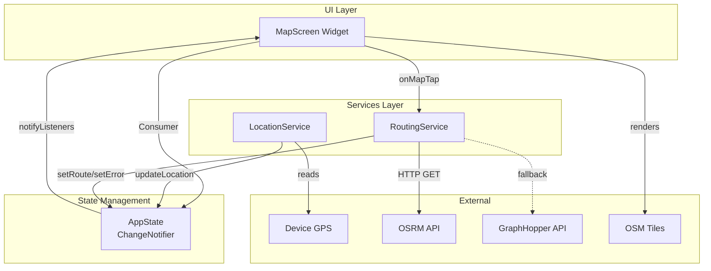

# Components

## Component Architecture

### MapScreen (UI Layer)

**Responsibility:** Full-screen map interface, user interaction handling, visual rendering of location/destination/route

**Key Interfaces:**

- Consumes `AppState` via Provider for reactive UI updates
- Exposes tap gesture handler: `onMapTap(LatLng coordinates)`
- Renders flutter_map widget with OSM tiles
- Displays markers (blue dot for location, red pin for destination)
- Renders route polyline overlay

**Dependencies:** AppState, RoutingService, flutter_map, latlong2

**Technology Stack:** Flutter widgets (StatelessWidget consuming Provider), flutter_map's FlutterMap widget, Material Design components

---

### LocationService (Business Logic Layer)

**Responsibility:** GPS position tracking, permission handling, location stream management

**Key Interfaces:**

- `Stream<UserLocation> getLocationStream()` - Continuous location updates
- `Future<UserLocation> getCurrentLocation()` - One-time location fetch
- `Future<bool> requestPermission()` - Handle location permissions
- `Future<bool> isLocationServiceEnabled()` - Check GPS enabled

**Dependencies:** geolocator package, AppState

**Technology Stack:** Dart async/await and Streams, geolocator for cross-platform GPS access

---

### RoutingService (Business Logic Layer)

**Responsibility:** Route calculation via external APIs, fallback logic, response parsing, error handling

**Key Interfaces:**

- `Future<Route> calculateRoute(UserLocation start, Destination end)` - Main calculation method
- `Future<Route> _fetchRouteFromOSRM(...)` - OSRM API call (private)
- `Future<Route> _fetchRouteFromGraphHopper(...)` - GraphHopper API call (private)

**Dependencies:** http package, AppState

**Technology Stack:** Dart async/await, http package for REST calls, JSON parsing with dart:convert

**Implementation Notes:** Implements fallback logic (OSRM primary, GraphHopper fallback), 5-second timeout per API call

---

### AppState (State Management Layer)

**Responsibility:** Central state container, reactive change notifications, state coordination

**Key Interfaces:**

- `UserLocation? currentLocation` - Current GPS position
- `Destination? destination` - User-selected destination
- `Route? route` - Calculated route
- `bool isLoadingRoute` - Loading state for UI
- `String? errorMessage` - Error state for toast display
- State update methods that call `notifyListeners()`

**Dependencies:** provider package (ChangeNotifier)

**Technology Stack:** Provider pattern (ChangeNotifier + Consumer), Dart null safety

---

## Component Interaction Diagram

