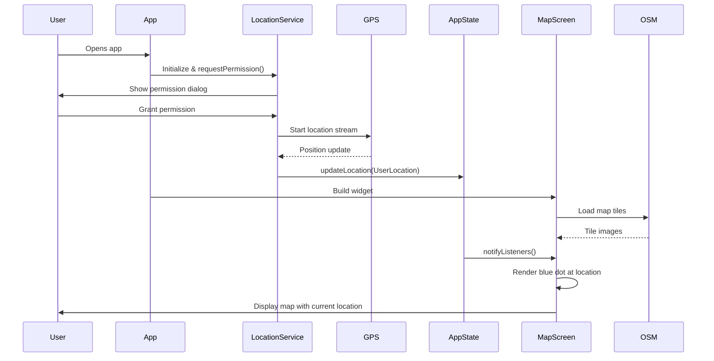
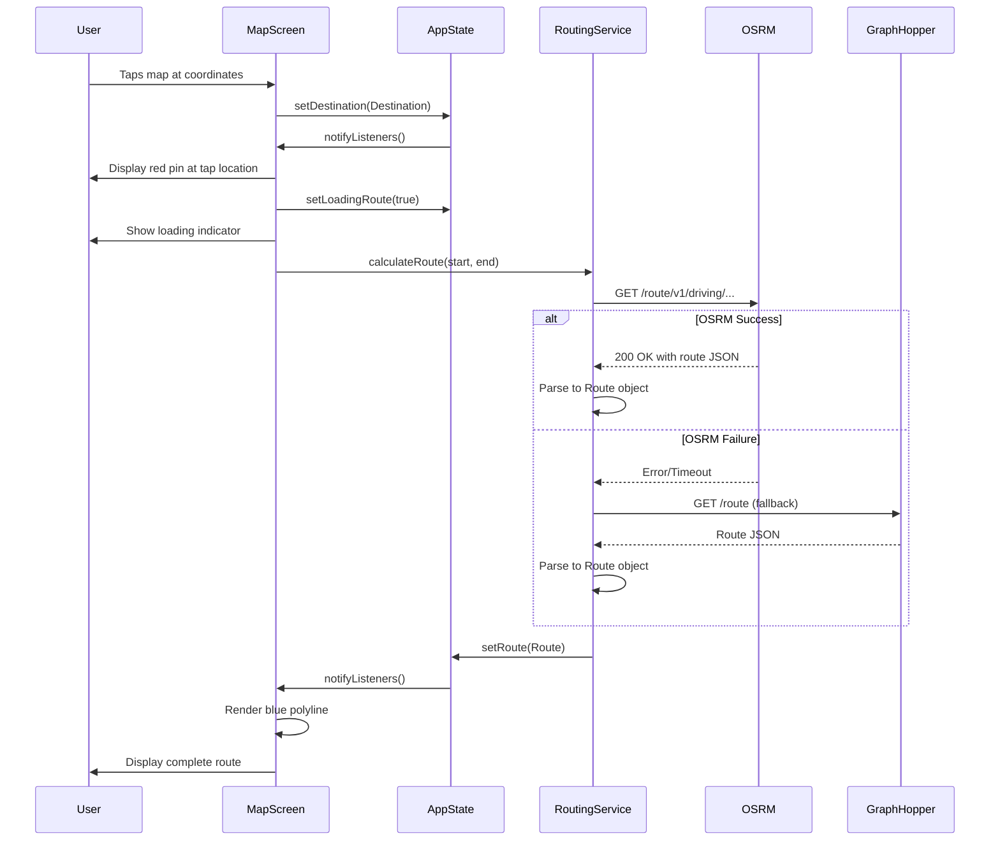
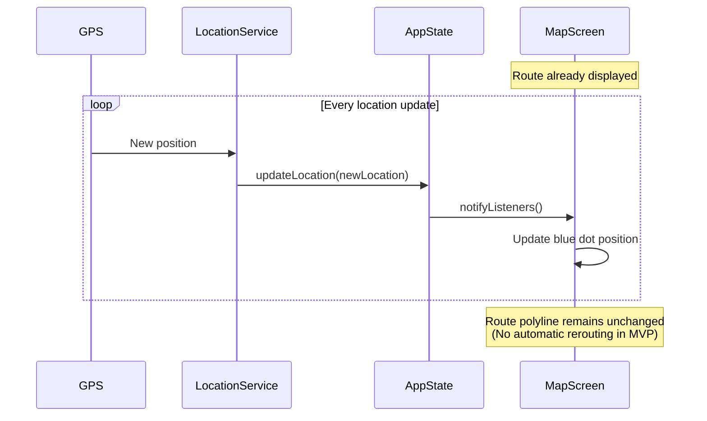

# Core Workflows

## Workflow 1: App Launch and Initial Location Display

**Success Criteria:** Map loads within 3 seconds (NFR1), location appears as blue dot

---

## Workflow 2: User Sets Destination and Views Route

**Success Criteria:** Route calculates within 5 seconds (NFR3), polyline renders smoothly

---

## Workflow 3: Location Updates While Route Active

**Success Criteria:** Blue dot updates smoothly, UI responds within 100ms (NFR2)

**MVP Limitation:** No automatic rerouting when user deviates from path (out of scope)
