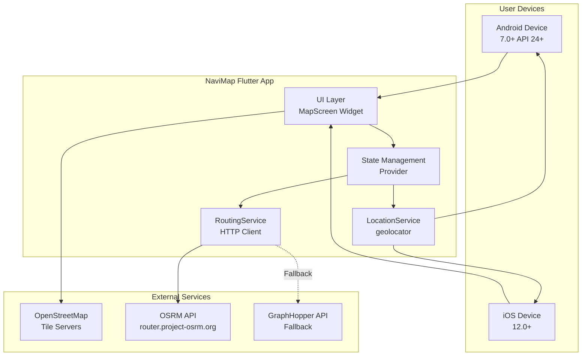

# High Level Architecture

## Technical Summary

NaviMap employs a **single-tier mobile client architecture** built with Flutter 3.24+ and Dart 3.5+. The application renders an interactive map using the flutter_map package with OpenStreetMap tiles, manages location via the geolocator package, and calculates routes by making HTTPS requests to external OSRM/GraphHopper APIs. State management uses the Provider pattern for reactive UI updates. The architecture eliminates all backend infrastructure - there are no servers, databases, or authentication systems. The app runs entirely on-device with stateless API calls to third-party routing services. This minimalist approach enables rapid MVP delivery, ensures privacy compliance (zero data collection), and achieves the PRD's goal of 100% open-source, zero-cost operation.

## Platform and Infrastructure Choice

**Platform:** None (client-side mobile app)  
**Key External Services:** OpenStreetMap tiles, OSRM routing API, GraphHopper routing API (fallback)  
**Deployment Targets:** Android 7.0+ (API 24+), iOS 12.0+  
**Distribution:** Google Play Store, Apple App Store

## Repository Structure

**Structure:** Single Repository (Monolithic Flutter Project)  
**Monorepo Tool:** N/A - standard Flutter project  
**Package Organization:** Single `lib/` directory with feature-based organization

## High Level Architecture Diagram

## Architectural Patterns

- **Single-Screen Application:** Entire UI is one full-screen map widget with no navigation chrome - _Rationale:_ Aligns with PRD's radical minimalism goal, reduces development complexity, eliminates need for navigation libraries

- **Service-Oriented Architecture (SOA):** Business logic separated into focused services (LocationService, RoutingService) - _Rationale:_ Testability, separation of concerns, enables AI agents to work on isolated components

- **Provider State Management:** Reactive state updates using Flutter's provider package - _Rationale:_ Official recommendation, simple for small apps, perfect for location/route state propagation to UI

- **Repository Pattern (Lightweight):** RoutingService abstracts API implementation details with fallback logic - _Rationale:_ Enables switching between OSRM/GraphHopper transparently, future-proofs for self-hosted APIs

- **Stateless Architecture:** Zero persistent storage, all state ephemeral and cleared on app close - _Rationale:_ Satisfies NFR6/NFR12 privacy requirements, eliminates database complexity

- **Fail-Fast with Graceful Degradation:** Primary API failures trigger immediate fallback to secondary API - _Rationale:_ Ensures routing availability despite free API unreliability, meets NFR11

- **Direct API Integration (No Backend):** Client makes direct HTTPS calls to external routing APIs - _Rationale:_ Eliminates backend development/hosting costs, achieves NFR5 (zero paid services)
